# SnapGlow — Azure Virtual Desktop Lab

A hands-on Azure Virtual Desktop (AVD) lab simulating a small-business remote-work environment for **SnapGlow**. The project focuses on secure user access, pooled desktops, identity integration, cost control, backup, and practical troubleshooting.

## Project Overview

**Scenario:** SnapGlow needs a small, centrally managed Windows desktop environment where two users can securely access a business workstation and a browser-based accounting application.

**Azure region:** UK South  
**Host pool:** `HP-SnapGlow-AVD`  
**Session host:** `VM-SnapGlow-0`  
**Resource group:** `RG-SnapGlow-AVD`  
**Host pool type:** Pooled  
**Maximum concurrent sessions:** 1

## Architecture

```text
SnapGlow Users
      |
      v
Azure Virtual Desktop Workspace
      |
      v
Desktop Application Group
      |
      v
Pooled Host Pool
      |
      v
VM-SnapGlow-0
Windows 11 Enterprise multi-session
      |
      +--> Microsoft Entra ID
      +--> Microsoft Intune
      +--> SSO / Entra authentication
      +--> Microsoft Edge / QuickBooks Online
      +--> Azure Backup
      +--> Cost Management
```

## Technologies & Azure Services

- Azure Virtual Desktop
- Windows 11 Enterprise multi-session
- Microsoft Entra ID
- Microsoft Intune
- Azure RBAC
- AVD Desktop Application Groups and Workspaces
- Start VM on Connect
- AVD power-management autoscaling
- Azure Recovery Services Vault / Azure Backup
- Azure Cost Management budgets
- PowerShell
- Windows networking and connectivity testing

## Implementation Highlights

### 1. AVD deployment

Created a pooled AVD host pool with a Windows 11 Enterprise multi-session session host in UK South.

### 2. Identity and access

Configured Microsoft Entra ID authentication, SSO, user assignments, and VM User Login permissions. The session host was verified with `dsregcmd /status` as Azure AD joined.

### 3. User experience

Two SnapGlow test users were assigned to the desktop application group. User 1 successfully connected to the desktop and accessed QuickBooks Online through Microsoft Edge.

### 4. Session capacity control

The host pool maximum session limit was configured to **1**. With User 1 connected, User 2 received the expected **no available resources** message. This demonstrated practical concurrency control in a pooled AVD environment.

### 5. Start VM on Connect and autoscaling

Enabled Start VM on Connect and configured an AVD scaling plan for weekday business hours. The Azure Virtual Desktop service principal was granted the required power-management permissions at subscription scope.

### 6. Backup and recovery

Configured Azure Backup using Recovery Services Vault with a daily backup policy and verified application-consistent recovery points. A restore to an alternate VM was also tested. The Azure File Recovery client encountered an `Index was out of bounds` error during the file-level recovery test, which was documented as a troubleshooting finding rather than hidden.

### 7. Cost management

Created a dedicated SnapGlow monthly budget of **$20** with an actual-cost alert at **80% ($16)**. The budget was created at billing-account scope.

### 8. Troubleshooting

Performed practical AVD troubleshooting checks including session host power and health state, AVD health checks, drain mode, maximum session capacity, application group assignments, workspace/application-group association, and outbound HTTPS connectivity.

Network testing from the session host confirmed TCP connectivity to `www.microsoft.com` on port 443.

## Validation Results

| Test | Result |
|---|---|
| AVD desktop connection | Passed |
| Windows 11 multi-session host | Passed |
| Entra ID authentication / SSO | Passed |
| QuickBooks Online browser access | Passed |
| User assignment | Passed |
| Maximum session limit = 1 | Passed |
| User 2 blocked when capacity reached | Passed / Expected behavior |
| Start VM on Connect | Enabled |
| Autoscale configuration | Configured |
| AVD session-host health checks | All passed |
| Outbound TCP 443 connectivity | Passed |
| Azure Backup recovery points | Created |
| Alternate VM restore | Tested |
| Azure File Recovery | Troubleshooting required |
| MFA / Conditional Access | Not implemented — tenant licensing limitation |
| Cost budget | Configured |

## Troubleshooting Approach

The lab uses a layered troubleshooting model:

**User → Workspace → Application Group → Host Pool → Session Host → VM → Network**

Instead of immediately changing settings, each incident was narrowed down by checking the relevant service health, assignments, session capacity, authentication, and network connectivity.

## Screenshots

The screenshots below document the major configuration and validation stages of the lab.

### AVD Configuration

| Host Pool | Session Host |
|---|---|
| 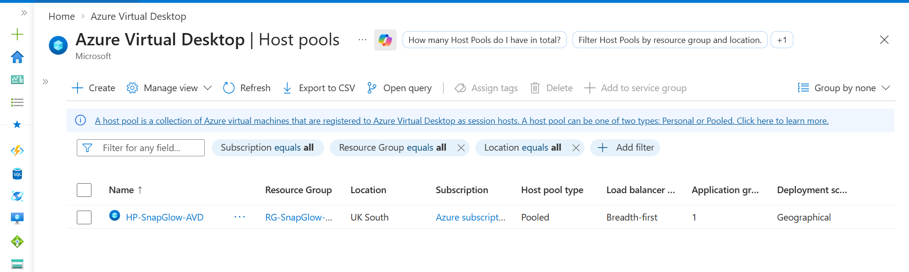 | 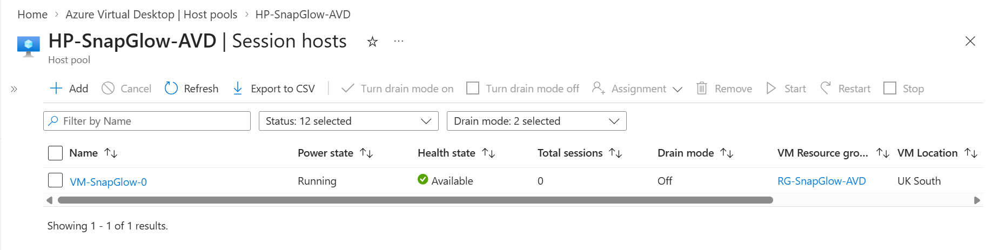 |

| Host Pool Properties | Application Group |
|---|---|
| 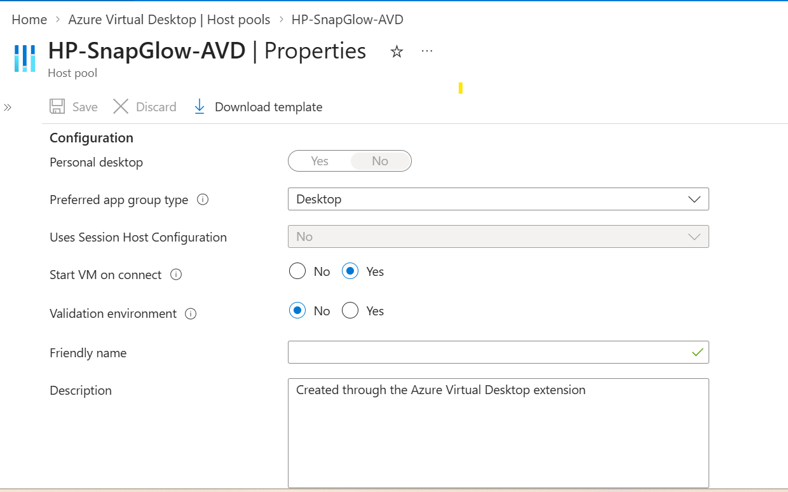 | 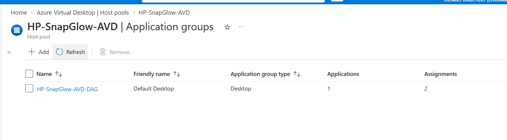 |

| Workspace | User Assignments |
|---|---|
| 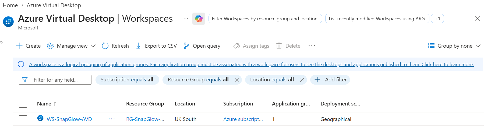 | 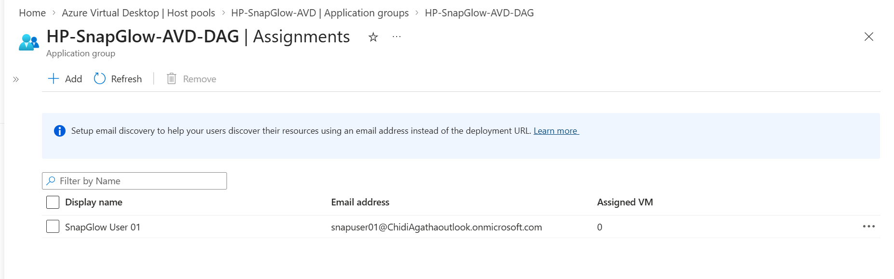 |

### Access, RBAC and Scaling

| AVD Assignment | VM User Login RBAC |
|---|---|
| 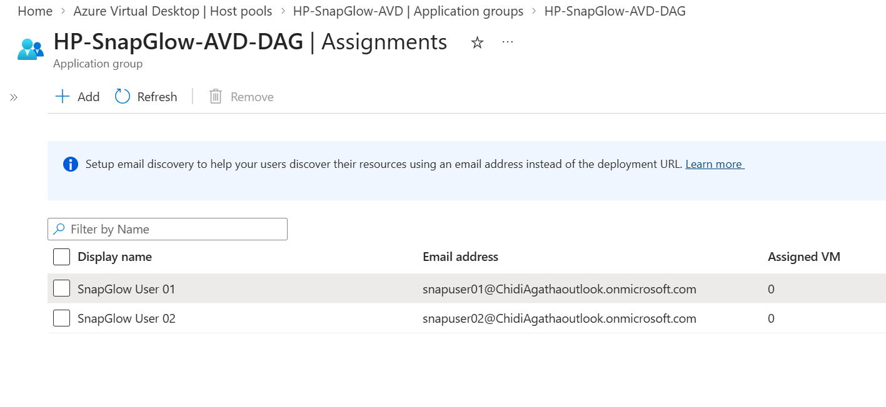 | 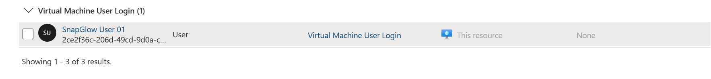 |

| Subscription RBAC | Device Settings |
|---|---|
| 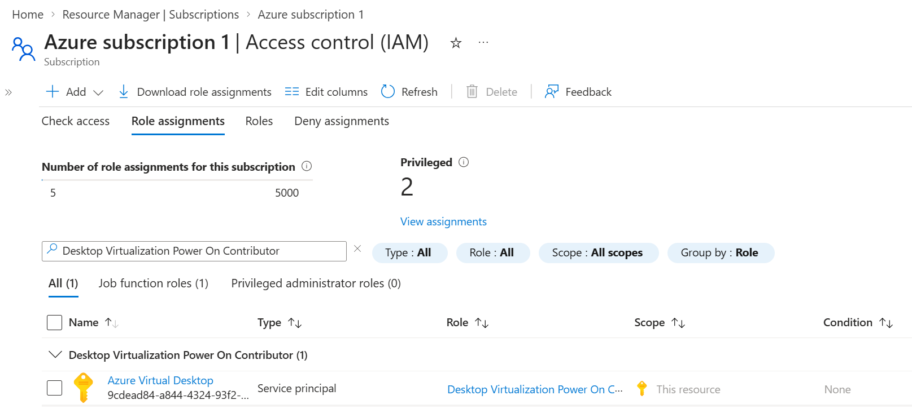 | 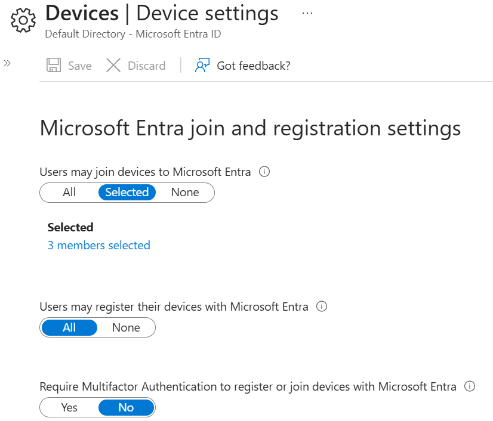 |

| Scaling Plan | Windows Version |
|---|---|
| 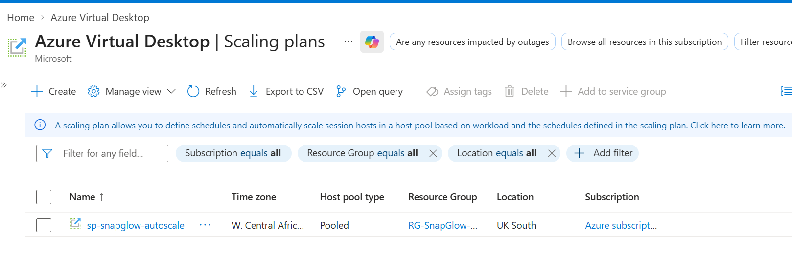 | 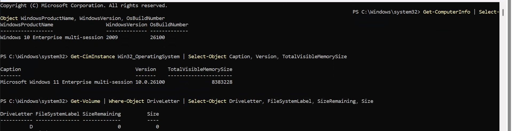 |

### User Experience and Validation

| User 1 Session | Session Desktop |
|---|---|
| 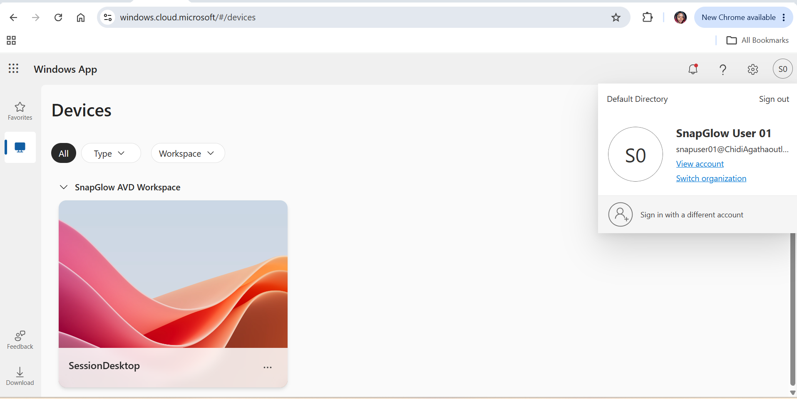 | 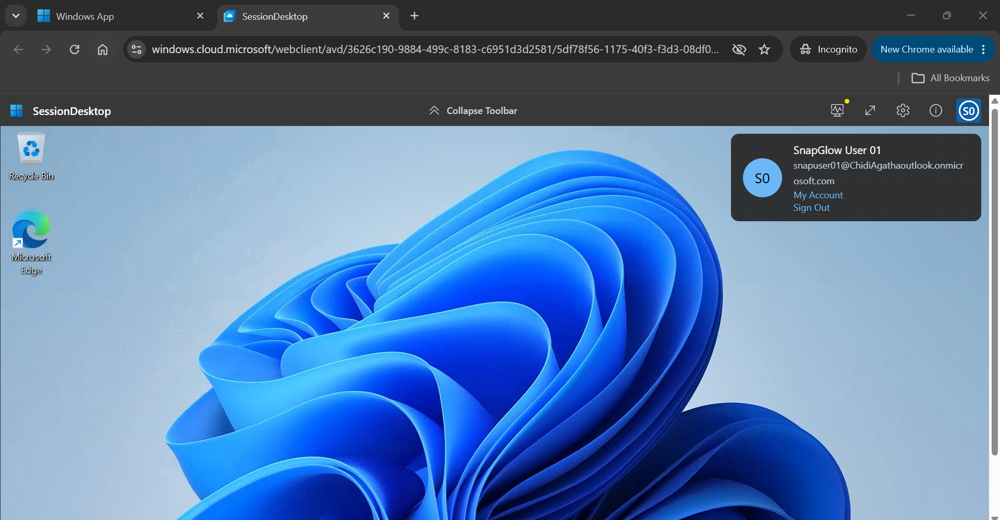 |

| User 2 — No Available Resources | User 2 Window App |
|---|---|
| 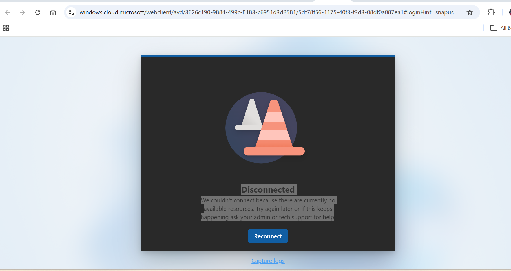 | 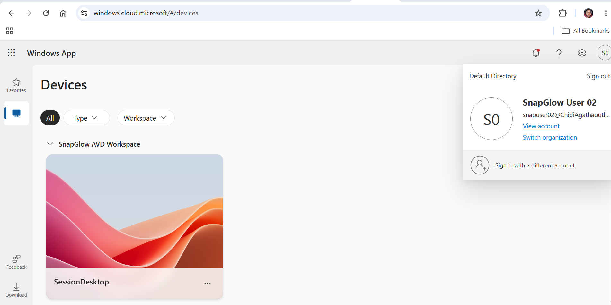 |

### Cost and Connectivity

| Monthly Budget | Microsoft Connectivity Test |
|---|---|
| 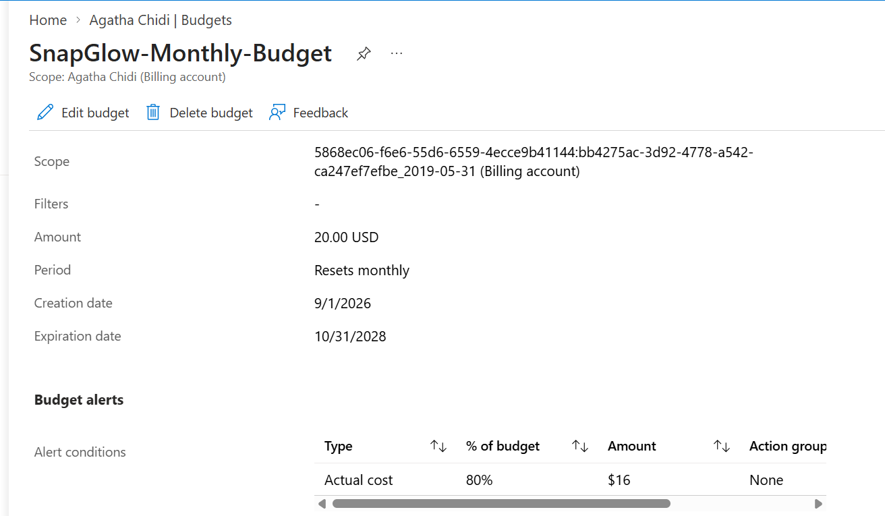 | 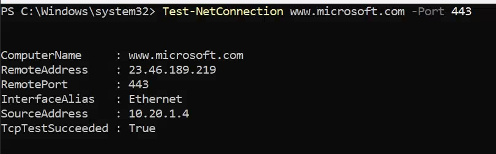 |

## Important Lab Notes

- This is a hands-on learning and portfolio environment, not a production deployment.
- No real customer accounting data was stored in the VM.
- QuickBooks Online was accessed through Microsoft Edge rather than installed as a desktop application.
- MFA / Conditional Access was not implemented because the tenant did not have sufficient licensing for the required product experience.
- Backup file-level recovery was tested and documented honestly, including the recovery-client error encountered.
- The environment was designed with cost awareness in mind, including Start VM on Connect, autoscaling, and a monthly budget.

## Skills Demonstrated

**Azure:** Azure Virtual Desktop, Entra ID, Intune, RBAC, Azure Backup, Cost Management, VM management  
**Windows:** Windows 11 Enterprise multi-session, PowerShell, session-host administration, troubleshooting  
**Operations:** Identity and access management, remote desktop delivery, capacity management, backup/recovery testing, cost control, incident troubleshooting
